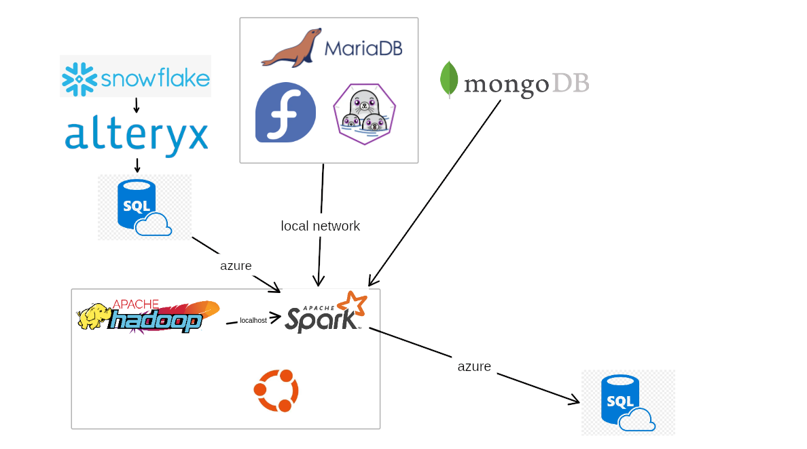

# ETL_Demo
## Network typology

# Data source for snowflake
- https://github.com/dr5hn/countries-states-cities-database
- https://www.kaggle.com/datasets/apoorvaappz/global-super-store-dataset?resource=download
